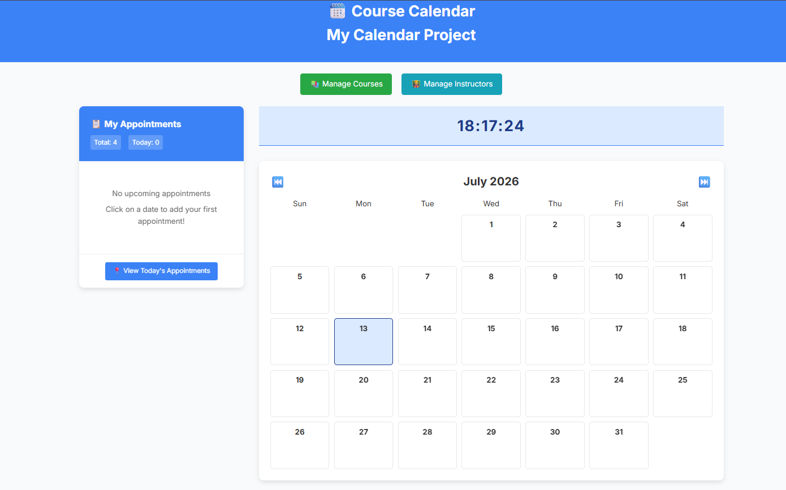
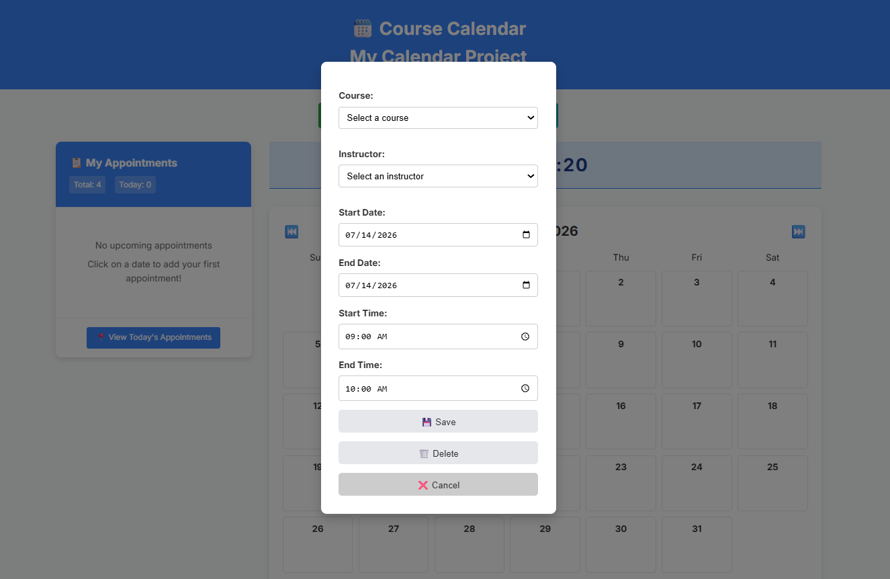

# 📅 Course Calendar Management System

A web-based Course Calendar Management System developed using PHP, MySQL, HTML, CSS, and JavaScript. This application allows users to manage courses, instructors, and appointments through a simple and user-friendly calendar interface.

---

## 📖 Overview

The Course Calendar Management System is designed to help educational institutions organize course schedules efficiently. Users can manage instructors, courses, and appointments while viewing schedules through a calendar interface.

---

## ✨ Features

- 📚 Add New Courses
- ✏️ Edit Course Details
- 👨‍🏫 Add New Instructors
- ✏️ Edit Instructor Details
- 📅 Add Course Appointments
- 📋 View All Courses
- 👥 View All Instructors
- 🗓️ Calendar View
- 💾 MySQL Database Integration
- 🖥️ Simple & User-Friendly Interface

---

## 🛠 Technologies Used

| Technology | Purpose |
|------------|---------|
| PHP | Backend Development |
| MySQL | Database Management |
| HTML5 | Web Structure |
| CSS3 | Styling |
| JavaScript | Client-side Functionality |
| WAMP Server | Local Development Environment |
| phpMyAdmin | Database Administration |

---

## 📂 Project Structure

```text
Course-Calendar/
│
├── add_course.php
├── add_instructor.php
├── calendar.php
├── calendar.js
├── connection.php
├── course_calendar.sql
├── edit_course.php
├── edit_instructor.php
├── manage_courses.php
├── manage_instructors.php
├── index.php
├── style.css
├── home.png
├── add_appoinment.png
├── resources.txt
└── README.md
```

---

## ⚙️ Installation Guide

### Step 1 - Install WAMP Server

Download and install WAMP Server.

---

### Step 2 - Copy the Project

Copy the project folder to:

```text
C:\wamp64\www\
```

---

### Step 3 - Start Services

Start:

- Apache
- MySQL

---

### Step 4 - Open phpMyAdmin

```text
http://localhost/phpmyadmin
```

---

### Step 5 - Create Database

Create a database named:

```text
course_calendar
```

---

### Step 6 - Import Database

Import the SQL file:

```text
course_calendar.sql
```

---

### Step 7 - Configure Database

Open connection.php

```php
<?php

$host = "localhost";
$user = "root";
$password = "";
$db = "course_calendar";

$conn = mysqli_connect($host, $user, $password, $db);

?>
```

Update the credentials if your MySQL configuration is different.

---

### Step 8 - Run the Project

Open your browser and visit:

```text
http://localhost/Course-Calendar/
```

---

# 📸 Screenshots

## 🏠 Home Page



---

## ➕ Add Appointment



---

## 🚀 Future Improvements

- 🔐 User Login & Authentication
- 👤 Role-based Access Control
- 🔍 Search Courses
- 🔍 Search Instructors
- 📧 Email Notifications
- 📱 Responsive Design
- 📊 Dashboard
- 📅 Calendar Filters
- 📤 Export Calendar
- 🌙 Dark Mode

---

## 🎯 Learning Outcomes

This project demonstrates knowledge of:

- PHP CRUD Operations
- MySQL Database Design
- HTML & CSS
- JavaScript
- Form Validation
- Database Connectivity
- Calendar Management
- Web Application Development

---

## 👩‍💻 Developer

Sasikala Somarathna

Bachelor of Information and Communication Technology (BICT)

Faculty of Technology

Rajarata University of Sri Lanka

---

## 📜 License

This project is developed for educational purposes only.

---

## 🤝 Contributions

Contributions, suggestions, and improvements are welcome.

Feel free to fork this repository and submit a pull request.

---

## ⭐ Support

If you found this project useful, please consider giving it a ⭐ on GitHub.

Thank you for visiting this repository!
